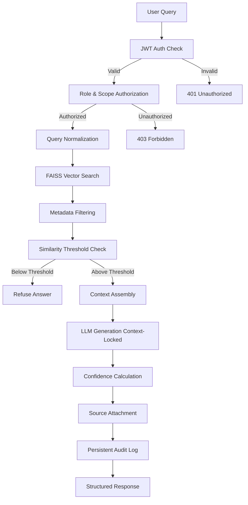

# EVIDENT - 30 Phase Build Plan

## Architecture Overview

EVIDENT is a secure, evidence-grounded RAG system with strict hallucination prevention, role-based access control, and comprehensive audit logging. The system uses FastAPI backend, Next.js frontend, PostgreSQL for metadata, FAISS for vector search, and llama.cpp for local LLM inference.

### System Flow

## Phase Breakdown

### Foundation & Infrastructure (Phases 1-5)

**Phase 1: Project Structure & Configuration**

- Create directory structure (`backend/`, `frontend/`, `data/`)
- Set up Python virtual environment
- Create `requirements.txt` with FastAPI, SQLAlchemy, FAISS, sentence-transformers, llama-cpp-python
- Create `backend/core/config.py` with environment-based configuration
- Set up `.env` template
- Create `README.md` with project overview

**Phase 2: Database Models & Schema**

- Set up PostgreSQL connection in `backend/core/database.py`
- Create SQLAlchemy models: `User`, `Document`, `DocumentChunk`, `AuditLog`, `Role`, `Permission`
- Define relationships and indexes
- Create Alembic migration setup
- Generate initial migration

**Phase 3: Core Utilities & Logging**

- Implement structured logging in `backend/utils/logger.py`
- Create configuration management in `backend/core/config.py`
- Set up error handling utilities
- Create response models and schemas

**Phase 4: Security Foundation**

- Implement JWT token generation/validation in `backend/auth/jwt.py`
- Set up bcrypt password hashing utilities
- Create password validation rules
- Implement token refresh logic

**Phase 5: Authentication Endpoints**

- Create login endpoint in `backend/auth/routes.py`
- Implement refresh token endpoint
- Add logout functionality
- Create user registration endpoint (admin-only)
- Add password reset flow

### Authorization & Access Control (Phases 6-7)

**Phase 6: Role-Based Access Control (RBAC)**

- Implement role checking middleware
- Create permission decorators for endpoints
- Build document-level access control logic
- Implement mission/project scoping
- Create admin role management endpoints

**Phase 7: Document Access Control**

- Implement chunk-level permission checking
- Create document metadata filtering by role
- Build query-time access filtering
- Add document ownership and sharing logic

### Document Management (Phases 8-9)

**Phase 8: Document Ingestion Pipeline**

- Create `backend/ingestion/ingest_docs.py`
- Implement PDF parsing (PyPDF2/pdfplumber)
- Build text chunking with overlap
- Extract metadata (title, author, date, mission)
- Store raw documents in `data/raw_docs/`

**Phase 9: Vector Store Setup**

- Set up FAISS index in `backend/rag/vector_store.py`
- Implement sentence transformer embedding (`e5-base`)
- Create vector persistence to `data/vector_store/`
- Build index loading and saving utilities
- Implement incremental index updates

### RAG Core Pipeline (Phases 10-13)

**Phase 10: RAG Retrieval System**

- Create `backend/rag/retriever.py`
- Implement query embedding
- Build FAISS similarity search
- Add metadata filtering (role, mission, document type)
- Implement top-k retrieval with configurable k
- Add similarity score thresholding

**Phase 11: LLM Integration (llama.cpp)**

- Set up llama-cpp-python in `backend/rag/generator.py`
- Load model and configure generation parameters
- Create context-locked prompt templates
- Implement strict instruction: "Answer only from provided context"
- Add temperature and token limit controls

**Phase 12: Confidence Scoring System**

- Create `backend/rag/confidence.py`
- Implement answer-source alignment scoring
- Calculate semantic similarity between answer and sources
- Build confidence threshold logic (default: 0.7)
- Create confidence-based refusal mechanism

**Phase 13: Hallucination Prevention**

- Create `backend/rag/refusal.py`
- Implement source verification checks
- Build answer validation against retrieved context
- Create refusal reasons (no docs, low similarity, conflicting sources)
- Add explicit refusal response format

### API Endpoints (Phases 14-16)

**Phase 14: Query API Endpoints**

- Create `/api/query` endpoint in `backend/main.py`
- Implement full RAG pipeline integration
- Add request/response models with Pydantic
- Include error handling and validation
- Return structured response: `{answer, confidence, sources[], refusal_reason}`

**Phase 15: Document Management API**

- Create `/api/documents` endpoints (CRUD)
- Implement document upload endpoint
- Add document deletion (with vector cleanup)
- Create document listing with pagination
- Add document metadata update endpoints

**Phase 16: Admin & Audit API**

- Create `/api/admin/users` endpoints
- Implement `/api/admin/audit-logs` with filtering
- Add `/api/admin/stats` for system metrics
- Create role management endpoints
- Add document permission management

### Frontend Foundation (Phases 17-21)

**Phase 17: Next.js Setup & Configuration**

- Initialize Next.js 14+ with App Router
- Configure TypeScript and Tailwind CSS
- Set up project structure (`app/`, `components/`, `lib/`)
- Create API client utilities
- Set up environment variables

**Phase 18: Authentication UI**

- Create `frontend/app/login/page.tsx`
- Implement login form with validation
- Add JWT token storage (httpOnly cookies or secure storage)
- Create auth context/provider
- Implement protected route middleware

**Phase 19: Dashboard Layout**

- Create `frontend/app/dashboard/layout.tsx`
- Build navigation sidebar with role-based menu
- Add user profile display (name, role)
- Implement logout functionality
- Create responsive layout with Tailwind

**Phase 20: Query Workspace UI**

- Create `frontend/app/query/page.tsx`
- Build query input form
- Add loading states and animations
- Implement query submission
- Create query history sidebar

**Phase 21: Results Display Component**

- Create `frontend/components/QueryResult.tsx`
- Display answer with confidence indicator
- Show source citations with links
- Add refusal message display
- Implement copy/share functionality

### Frontend Features (Phases 22-24)

**Phase 22: Query History & Audit Logs**

- Create `frontend/app/history/page.tsx`
- Display user's query history
- Add filtering and search
- Show confidence scores and sources
- Implement pagination

**Phase 23: Admin - Document Management UI**

- Create `frontend/app/admin/documents/page.tsx`
- Build document upload interface
- Display document list with metadata
- Add document deletion and editing
- Implement permission management UI

**Phase 24: Admin - User & Audit Management**

- Create `frontend/app/admin/users/page.tsx`
- Build user management interface
- Create `frontend/app/admin/audit/page.tsx` for audit logs
- Add role assignment UI
- Implement system statistics dashboard

### Integration & Testing (Phases 25-27)

**Phase 25: Backend-Frontend Integration**

- Connect all API endpoints to frontend
- Implement error handling across app
- Add loading states and error messages
- Test end-to-end query flow
- Verify authentication flow

**Phase 26: Backend Testing**

- Write unit tests for RAG components
- Test authentication and authorization
- Create integration tests for API endpoints
- Test document ingestion pipeline
- Add confidence scoring tests

**Phase 27: Frontend Testing**

- Write component tests (React Testing Library)
- Test authentication flows
- Test query submission and results
- Add E2E tests for critical paths
- Test admin functionality

### Documentation & Deployment (Phases 28-30)

**Phase 28: Comprehensive Documentation**

- Update `README.md` with full setup instructions
- Create `docs/ARCHITECTURE.md` with system design
- Document security model in `docs/SECURITY.md`
- Create API documentation (OpenAPI/Swagger)
- Add deployment guides

**Phase 29: Docker Setup**

- Create `Dockerfile` for backend
- Create `Dockerfile` for frontend
- Create `docker-compose.yml` with all services
- Add PostgreSQL and volume configurations
- Create `.dockerignore` files

**Phase 30: Production Readiness**

- Add environment variable validation
- Implement health check endpoints
- Create startup scripts
- Add monitoring and logging configuration
- Final testing and bug fixes
- Create deployment checklist

## Key Files to Create

### Backend Core

- `backend/main.py` - FastAPI application entry point
- `backend/core/config.py` - Configuration management
- `backend/core/database.py` - Database connection and session management
- `backend/core/security.py` - Security utilities

### Models

- `backend/models/user.py` - User model with roles
- `backend/models/document.py` - Document and chunk models
- `backend/models/audit_log.py` - Audit logging model

### RAG Pipeline

- `backend/rag/retriever.py` - Vector retrieval logic
- `backend/rag/generator.py` - LLM generation with llama.cpp
- `backend/rag/confidence.py` - Confidence scoring
- `backend/rag/refusal.py` - Hallucination prevention
- `backend/rag/vector_store.py` - FAISS management

### Frontend

- `frontend/app/login/page.tsx` - Login page
- `frontend/app/dashboard/page.tsx` - Main dashboard
- `frontend/app/query/page.tsx` - Query interface
- `frontend/app/admin/*` - Admin pages
- `frontend/components/*` - Reusable components

## Success Criteria

Each phase should result in:

- Working, testable code
- No placeholder/mock logic
- Proper error handling
- Security considerations addressed
- Clean, maintainable code structure

The final system must:

- Refuse answers when confidence is low
- Enforce role-based access control
- Log all queries to audit trail
- Provide source citations for every answer
- Work entirely on-premises (no external APIs)